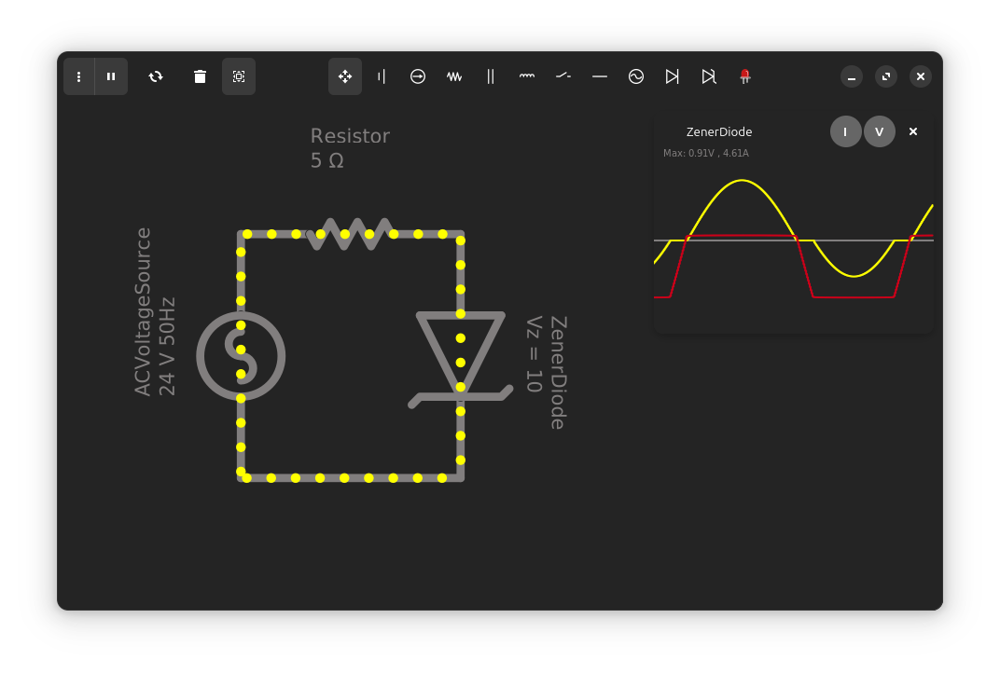

<a id="readme-top"></a>
<div align="center">
<a href="https://github.com/hamza-Algohary/Coulomb">
    
</a>
<h3 style="font-size:36px" align="center">Coulomb</h3>
<p align="center">
Um aplicativo simulador de circuitos simples e bonito para Linux.</p>
<a href="https://flathub.org/apps/io.github.hamza_algohary.Coulomb">
   
</a>
<br/><br/>
</div>




## Instalação
Você pode instalar o Coulomb do [Flathub](https://flathub.org/apps/io.github.hamza_algohary.Coulomb).

Como alternativa, você pode baixar o arquivo jar diretamente do [releases](https://github.com/hamza-algohary/Coulomb/releases)

## Recursos
- Desenhar circuitos arbitrários
- Plotar tensão e corrente de dispositivos em relação ao tempo
- Salvar/Carregar circuitos
- Suporte ao Modo Escuro
- Interface de usuário bonita

## Dispositivos disponíveis
- Resistor
- Bateria
- Fonte de corrente
- Fonte de tensão CA
- Indutor
- Capacitor
- Diodo
- Diodo Zener

## Problemas
1. Circuitos contendo dispositivos não lineares provavelmente não serão solucionáveis, porque o backend atual não é bom em lidar com sistemas não lineares, mas isso vai mudar.
2. Devido à forma como indutores e capacitores são modelados, você não pode colocar dois indutores em série, ou dois capacitores em paralelo, isso também será corrigido.

## Construindo a partir da fonte
1. Certifique-se de que [Gtk4](https://www.gtk.org/docs/installations/), libadwaita e [Gradle](https://gradle.org/install/) estejam instalados em sua máquina.
2. Clone este repositório:
```
git clone https://github.com/hamza-Algohary/Coulomb
```
3. Navegue até a pasta do projeto
```
cd Coulomb
```
4. Crie e execute
```
./gradlew run
```
> [!NOTA]
> Você também pode criar o pacote flatpak e executá-lo:
> ```
> make
> make run
> ```

## Créditos
- O backend do Coulomb usa [Efficient Java Matrix Library](https://github.com/lessthanoptimal/ejml) para resolver sistemas lineares.
- O logotipo do Coulomb foi criado por Alhussien Algohary.
- O comportamento do Coulomb é inspirado no [Paul Falstad's Circuit Simulator](https://www.falstad.com/circuit/)
## License
Coulomb is released under the terms of the GNU General Public License v3
<!--## Acknowledgments-->
